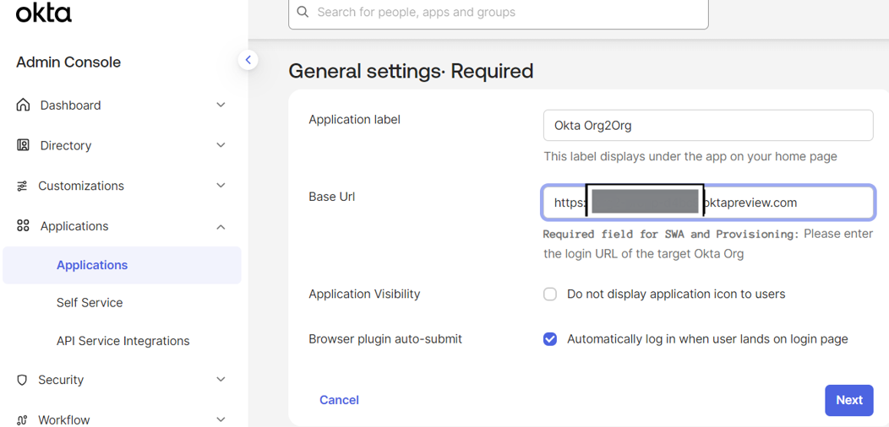

# Okta-Hub-and-Spoke-Identity-Integration

## Feature
+ Implemented a full Okta Org2Org SAML federation in a hub-and-spoke multi-tenant architecture, with the spoke acting as the primary identity provider
+ Configured SP-initiated and IdP-initiated SSO flows, enabling cross tenant authentication for applications
+ Designed attribute mapping to align profile schemas between tenants to facilitate automated lifecycle management cross Org2Org integration

### Steps
* ✅ At the spoke, set up Org2Org, and choose SAML

* ✅ At the spoke, enable provisioning

* ✅ At the spoke, assign Org2Org

* ✅ At the hub, set up IdP and enable linking

* ✅ At the spoke, map attributes

* ✅ Push groups from spoke to hub

